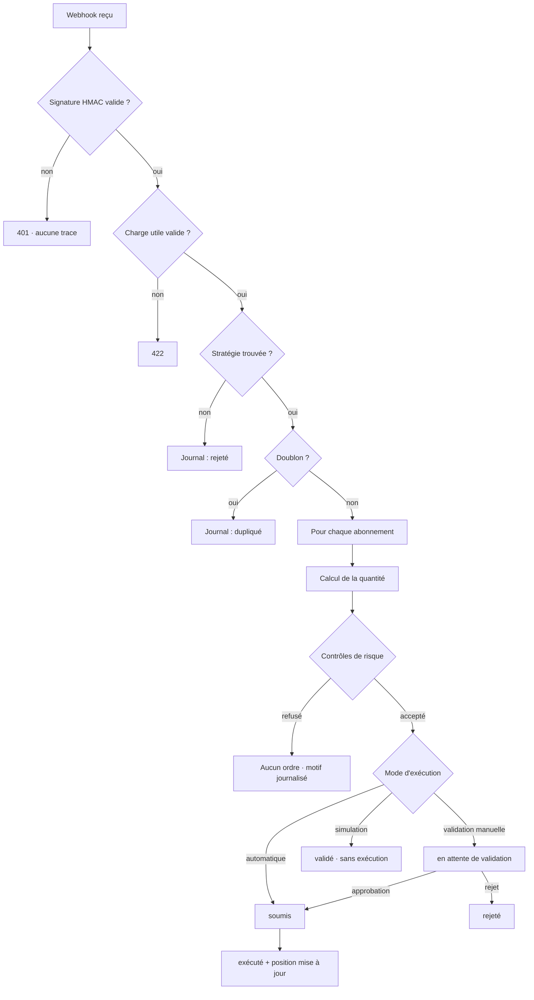

# Manuel technique — SignalDesk

Plateforme d'automatisation de trading par webhooks : réception de signaux, application de règles de risque, routage vers des comptes de courtage et suivi des ordres.

Ce manuel s'adresse aux profils techniques (installation, intégration, exploitation). Pour l'usage quotidien de l'interface, voir le [guide utilisateur](GUIDE-UTILISATEUR.md).

> **Avertissement.** Le trading automatisé comporte des risques financiers importants. Par défaut la plateforme n'exécute **aucun ordre réel** : le routage vers un courtier réel doit être activé explicitement (`ALLOW_LIVE_TRADING`). Lisez [Limites connues](#14-limites-connues) avant toute mise en production.

---

## Sommaire

1. [Architecture](#1-architecture)
2. [Installation et démarrage](#2-installation-et-démarrage)
3. [Concepts](#3-concepts)
4. [Cycle de vie d'un signal](#4-cycle-de-vie-dun-signal)
5. [Guide des écrans](#5-guide-des-écrans)
6. [Intégration webhook](#6-intégration-webhook)
7. [Contrôles de risque](#7-contrôles-de-risque)
8. [Dimensionnement des ordres](#8-dimensionnement-des-ordres)
9. [Statuts de référence](#9-statuts-de-référence)
10. [API REST](#10-api-rest)
11. [Sécurité](#11-sécurité)
12. [Exploitation](#12-exploitation)
13. [Dépannage](#13-dépannage)
14. [Limites connues](#14-limites-connues)

---

## 1. Architecture

Trois briques indépendantes dans un monorepo npm :

| Brique | Dossier | Rôle | Port par défaut |
|---|---|---|---|
| Front | `apps/web` | Interface Next.js. Ne contient **aucune** logique métier : simple client de l'API. | 3000 |
| Back | `apps/api` | Express + PostgreSQL. Ingestion des signaux, moteur de risque, cycle de vie des ordres. | 4000 |
| Partagé | `packages/shared` | Types TypeScript, schémas Zod et moteur de risque communs. | — |

Le front interroge `GET /api/state` toutes les 3 à 8 secondes pour se synchroniser. Toute décision métier est prise côté serveur : les garde-fous ne sont pas contournables depuis le navigateur.

---

## 2. Installation et démarrage

### 2.1 Prérequis

- Node.js 20 ou supérieur
- Une base PostgreSQL (Supabase, Docker, ou instance locale) — **optionnelle en développement**

### 2.2 Installation

```bash
npm install
```

L'installation construit automatiquement `packages/shared` (script `prepare`).

### 2.3 Configuration

Copiez `.env.example` vers `apps/api/.env` et `apps/web/.env.local`.

**Backend — `apps/api/.env`**

| Variable | Obligatoire | Description |
|---|---|---|
| `PORT` | non | Port d'écoute (défaut `4000`). |
| `DATABASE_URL` | en production | Chaîne PostgreSQL. Vide en développement ⇒ base en mémoire. |
| `DATABASE_SSL` | avec Supabase | `true` pour activer TLS. |
| `ENCRYPTION_KEY` | en production | 32 octets en hexadécimal (`openssl rand -hex 32`). Chiffre les identifiants courtiers. |
| `CORS_ORIGINS` | oui | Origines autorisées, séparées par des virgules. |
| `WEBHOOK_RATE_LIMIT` | non | Requêtes par minute et par IP sur l'endpoint public (défaut `60`). |
| `CRON_SECRET` | serverless | Protège `/api/tasks/tick`. |
| `DB_POOL_MAX` | non | Taille du pool (défaut `10`, mettre `1` derrière un pooler). |
| `TICK_MIN_INTERVAL_MS` | non | Anti-rebond du traitement déclenché par les lectures (défaut `3000`). |
| `ALLOW_LIVE_TRADING` | pour le réel | `true` autorise l'envoi d'ordres réels. **Défaut `false`.** |
| `ALPACA_BASE_URL` | non | Surcharge l'URL Alpaca (tests). |
| `RISK_TIMEZONE` | non | Fuseau de la règle de plage horaire (défaut `America/New_York`). |
| `ALERT_MIN_SEVERITY` | non | Seuil d'alerte : `info`, `success`, `warning` (défaut) ou `error`. |
| `ALERT_WEBHOOK_URL` | non | Webhook générique recevant la notification en JSON. |
| `CHAT_WEBHOOK_URL` | non | Webhook entrant Slack ou Discord. |
| `SMTP_URL` / `ALERT_EMAIL_FROM` / `ALERT_EMAIL_TO` | non | Alertes par e-mail. |
| `SIGNUP_CODE` | non | Code d'invitation exigé après le premier compte. Vide = inscriptions fermées. |
| `COOKIE_SAMESITE` | cross-domaine | `lax` (défaut), `none` ou `strict`. |
| `COOKIE_SECURE` | production | `true` pour n'émettre le cookie qu'en HTTPS. |

> **Attention.** Changer `ENCRYPTION_KEY` rend illisibles tous les identifiants courtiers déjà enregistrés.

**Frontend — `apps/web/.env.local`**

```
NEXT_PUBLIC_API_URL=http://localhost:4000
```

Cette variable est **figée au moment du build**. Après changement, il faut reconstruire le front.

### 2.4 Base de données

**Supabase** — collez [`supabase-setup.sql`](supabase-setup.sql) dans le SQL Editor, puis :

```bash
npm run db:seed
```

**PostgreSQL local (Docker)**

```bash
docker compose up -d
npm run db:migrate
npm run db:harden   # optionnel hors Supabase
npm run db:seed
```

**Sans base** — laissez `DATABASE_URL` vide : l'API démarre sur une base PostgreSQL en mémoire, pré-remplie avec les données de démonstration. Les données sont **perdues à chaque arrêt**. Ce mode est refusé si `NODE_ENV=production`.

### 2.5 Commandes

| Commande | Effet |
|---|---|
| `npm run dev` | Démarre le back et le front simultanément. |
| `npm run dev:api` / `npm run dev:web` | Démarre une seule brique. |
| `npm run build` | Construit les trois paquets. |
| `npm run typecheck` | Vérifie les types sur tout le monorepo. |
| `npm run lint` | ESLint. |
| `npm test` | Suite de tests du back (121 assertions, base SQL en mémoire). |
| `npm run db:migrate` / `db:seed` / `db:harden` | Schéma / données / durcissement RLS. |
| `npm run db:script` | Régénère `supabase-setup.sql`. |

Le tableau de bord est ensuite accessible sur **http://localhost:3000/dashboard**.

---

## 3. Concepts

### Stratégie
Ensemble de règles appliquées aux signaux entrants d'une même source. Porte l'URL de webhook et son secret. Une stratégie a un statut : `brouillon`, `active`, `suspendue` ou `archivée`. **Seule une stratégie `active` produit des ordres.**

### Connexion
Un compte de courtage (courtier, environnement, devise, capital, pouvoir d'achat). Les identifiants API sont chiffrés en base et ne sont jamais renvoyés au navigateur.

### Abonnement
Le lien entre **une** stratégie et **une** connexion. C'est lui qui détermine comment un signal devient un ordre sur ce compte précis : mode d'exécution, dimensionnement, plafonds, autorisation de vente à découvert, éventuel remplacement de ticker.

> Une stratégie sans abonnement ne produit aucun ordre, même active. Une stratégie avec trois abonnements produit jusqu'à trois ordres par signal, un par compte.

### Signal
Un webhook entrant. Il est journalisé quoi qu'il arrive, même rejeté.

### Ordre
Instruction générée par un signal accepté, pour un abonnement donné.

### Position
Agrégat par ticker et par compte, mis à jour à chaque exécution.

### Règle de risque
Seuil global à la plateforme, indépendant des stratégies. Voir le chapitre [Contrôles de risque](#7-contrôles-de-risque) pour savoir lesquelles sont réellement appliquées.

---

## 4. Cycle de vie d'un signal



**Point important :** une signature invalide renvoie `401` **sans rien journaliser**. Si vous ne voyez aucune trace d'un signal envoyé, le problème est la signature ou l'identifiant de webhook — pas les règles.

---

## 5. Guide des écrans

### 5.1 Vue d'ensemble

Statistiques calculées en direct depuis les données réelles : signaux reçus, taux d'acceptation, nombre d'ordres, P&L non réalisé. Trois graphiques : signaux par heure, répartition des ordres par statut, P&L par jour.

| Bouton | Effet |
|---|---|
| **Flux temps réel** | Accélère la synchronisation (3 s au lieu de 8 s). |
| **Signal de test** | Envoie un signal signé sur une stratégie active tirée au hasard. |
| **Nouvelle stratégie** | Ouvre l'écran Stratégies. |

Une bannière indique l'état du coupe-circuit et renvoie vers l'écran Risque.

### 5.2 Stratégies

Chaque carte affiche le statut, la classe d'actifs, le nombre d'abonnements, les tickers autorisés et l'identifiant de webhook. Cliquez sur une carte pour ouvrir le panneau de détail.

**Créer une stratégie** — champs et contraintes :

| Champ | Contrainte |
|---|---|
| Nom | 3 à 60 caractères |
| Description | 10 à 300 caractères |
| Statut | `brouillon` par défaut |
| Classe d'actifs | actions, ETF, options, futures, crypto, forex |
| Actions autorisées | au moins une parmi `buy`, `sell`, `short`, `cover`, `exit`, `reverse` |
| Liste blanche / noire | tickers séparés par des virgules |
| Délai max. du signal | 1 à 3600 secondes |
| Volume max. | nombre positif |
| Exposition max. | nombre positif |
| Type d'ordre par défaut | `market`, `limit`, `stop`, `stop_limit` |
| Rejeter les doublons | active la déduplication par `signalId` |

Le webhook et son secret sont générés automatiquement à la création.

**Actions du panneau de détail :** copier l'URL, régénérer le secret, associer un abonnement, modifier, dupliquer (crée une copie en brouillon), suspendre/activer, supprimer.

> Supprimer une stratégie supprime **en cascade** tous ses abonnements, et son webhook cesse immédiatement d'accepter des signaux.

### 5.3 Webhooks

Une carte par stratégie : URL de réception, secret masqué (bouton œil pour l'afficher, bouton copier), et la référence du format JSON avec des exemples.

| Bouton | Effet |
|---|---|
| **Signal de test** | Construit une charge utile, la signe et l'envoie réellement à l'API. Le résultat indique le nombre d'ordres créés ou le motif de rejet. |
| **Régénérer le secret** | Invalide immédiatement l'ancien secret. |

Le journal des appels en bas de page liste les signaux reçus avec leur statut et leur motif de rejet.

### 5.4 Ordres

Tableau filtrable par texte (ticker, stratégie, compte, identifiant de signal) et par statut. Cliquez sur une ligne pour ouvrir le détail : chronologie, prix d'exécution, identifiant courtier, motif de rejet.

Actions disponibles selon le statut :

| Statut | Actions |
|---|---|
| En attente de validation | **Approuver** (passe en `soumis`) · **Rejeter** |
| Reçu, validé, soumis, envoi en cours | **Annuler** |
| Rejeté, erreur, annulé | **Réessayer** |
| Exécuté | aucune — l'API renvoie `409` |

**Exporter (CSV)** exporte les lignes filtrées, séparateur `;`, encodage UTF-8 avec BOM (compatible Excel).

### 5.5 Connexions

Une carte par compte : statut, environnement, capital, pouvoir d'achat, nombre de positions, instruments autorisés.

| Action | Effet |
|---|---|
| **Tester** | Vérifie la connexion et met à jour `status` et la date de dernier test. |
| **Interrupteur / Activer / Désactiver** | Bascule entre `actif` et `indisponible`. Une connexion non `actif` bloque tous ses ordres. |
| **Modifier** | Met à jour les métadonnées. Les identifiants ne sont **pas** renvoyés dans ce formulaire. |
| **Supprimer** | Supprime la connexion **et ses abonnements**. |

**Environnements :** `simulation` (papier), `demonstration`, `reel`. L'environnement est purement informatif aujourd'hui : aucune connexion courtier réelle n'est établie.

### 5.6 Positions

Valeur totale, P&L non réalisé, nombre de positions gagnantes et perdantes, puis le détail par ticker et par compte. **Clôturer** retire la position après confirmation. Export CSV disponible.

### 5.7 Risque

**Coupe-circuit global** — bouton avec confirmation. Une fois actif, **aucun ordre n'est créé** : les signaux continuent d'être reçus et journalisés avec le motif « Coupe-circuit actif ». L'état est persisté en base et reflété dans la barre latérale.

**Règles configurables** — dix règles avec un interrupteur d'activation et une valeur modifiable (icône crayon, `Entrée` pour valider, `Échap` pour annuler). Lisez le chapitre suivant : une seule est effectivement appliquée.

### 5.8 Historique

Deux journaux : le journal d'audit (actions sensibles, acteur, IP, sévérité) et l'historique des signaux. Recherche plein texte et filtre par sévérité. Les deux sont exportables en CSV.

Le journal d'audit est alimenté automatiquement : créations, modifications, suppressions, rotations de secret, changements d'état de connexion, actions sur les ordres, clôtures de position, modifications de règles et bascules du coupe-circuit.

### 5.9 Barre supérieure

- **Recherche globale** — `Ctrl+K` (ou `Cmd+K`). Parcourt stratégies, ordres, connexions et positions, et navigue vers l'écran correspondant.
- **Notifications** — badge de non-lues, clic pour marquer comme lue, bouton pour tout marquer.
- **Thème** — bascule clair/sombre, conservée dans le navigateur.

---

## 6. Intégration webhook

### 6.1 Requête

```
POST {API_URL}/api/webhook/{webhookId}
Content-Type: application/json
x-signaldesk-signature: {signature}
```

L'en-tête `x-signature` est également accepté. Le préfixe `sha256=` est toléré.

### 6.2 Signature

HMAC-SHA256 du **corps brut exact**, avec le secret de la stratégie, encodé en hexadécimal minuscule (64 caractères). La comparaison est faite à temps constant.

> Signez exactement les octets envoyés. Reformater le JSON après signature invalide la requête.

### 6.3 Charge utile

| Champ | Type | Obligatoire | Description |
|---|---|---|---|
| `ticker` | string (1–20) | **oui** | Instrument. Converti en majuscules. |
| `action` | enum | **oui** | `buy`, `sell`, `short`, `cover`, `exit`, `reverse` |
| `signalId` | string (1–100) | non | Clé de déduplication. Généré si absent. |
| `quantity` | number > 0 | non | Utilisé par le dimensionnement « taille du signal ». |
| `price` | number > 0 | non | Prix de référence. **Défaut : 100** si absent. |
| `stopLoss` | number > 0 | non | Stop-loss. Exigé par la règle `risk-008` sur futures et crypto. |
| `orderType` | enum | non | `market`, `limit`, `stop`, `stop_limit`. Défaut : celui de la stratégie. |
| `source` | string (≤ 60) | non | Étiquette affichée dans les journaux. |
| `timestamp` | string (≤ 40) | non | Date d'émission ISO 8601. Sert au calcul de fraîcheur du signal. |

> Omettre `price` fausse les contrôles d'exposition et le dimensionnement : la valeur 100 est utilisée par défaut. Renseignez-le systématiquement.

Charge utile minimale :

```json
{ "ticker": "AAPL", "action": "buy" }
```

### 6.4 Réponses

| Code | Signification |
|---|---|
| `202` | Signal traité. Le corps précise `accepted`, `status`, `ordersCreated` et `reason`. |
| `400` | JSON invalide. |
| `401` | Signature invalide, absente, ou webhook inconnu. |
| `413` | Corps supérieur à 8 Ko. |
| `422` | Charge utile non conforme (`details` liste les champs fautifs). |
| `429` | Limite de débit dépassée. |

Un `202` **ne signifie pas** qu'un ordre a été créé : vérifiez `ordersCreated` et `reason`.

```json
{
  "accepted": false,
  "status": "rejete",
  "signalId": "tv-000123",
  "strategy": "MACD Swing",
  "ordersCreated": 0,
  "reason": "TSLA absent de la liste blanche."
}
```

### 6.5 Exemples

**Bash**

```bash
SECRET="whsec_votre_secret"
BODY='{"signalId":"tv-000123","ticker":"AAPL","action":"buy","price":212.4}'
SIG=$(printf '%s' "$BODY" | openssl dgst -sha256 -hmac "$SECRET" -r | cut -d' ' -f1)

curl -X POST "http://localhost:4000/api/webhook/wd_8f3a2b1c" \
  -H "Content-Type: application/json" \
  -H "x-signaldesk-signature: $SIG" \
  -d "$BODY"
```

**Node.js**

```js
import { createHmac } from 'node:crypto';

const secret = process.env.SIGNALDESK_SECRET;
const body = JSON.stringify({ ticker: 'AAPL', action: 'buy', price: 212.4 });
const signature = createHmac('sha256', secret).update(body, 'utf8').digest('hex');

await fetch('http://localhost:4000/api/webhook/wd_8f3a2b1c', {
  method: 'POST',
  headers: { 'Content-Type': 'application/json', 'x-signaldesk-signature': signature },
  body,
});
```

**PowerShell**

```powershell
$secret = "whsec_votre_secret"
$body = '{"ticker":"AAPL","action":"buy","price":212.4}'
$hmac = [System.Security.Cryptography.HMACSHA256]::new([Text.Encoding]::UTF8.GetBytes($secret))
$sig = ($hmac.ComputeHash([Text.Encoding]::UTF8.GetBytes($body)) | ForEach-Object { $_.ToString("x2") }) -join ""

Invoke-RestMethod -Method Post -Uri "http://localhost:4000/api/webhook/wd_8f3a2b1c" `
  -ContentType "application/json" -Headers @{ "x-signaldesk-signature" = $sig } -Body $body
```

> **TradingView.** TradingView ne peut pas calculer de signature HMAC dans ses alertes. Un appel direct sera donc systématiquement rejeté en `401`. Il faut intercaler un relais (fonction serverless, n8n, Make…) qui reçoit l'alerte, signe la charge utile et la retransmet.

---

## 7. Contrôles de risque

Les vérifications s'appliquent **par abonnement**, dans cet ordre. La première qui échoue arrête le traitement pour cet abonnement et son motif est journalisé.

| # | Contrôle | Source | Motif de rejet |
|---|---|---|---|
| 1 | Coupe-circuit | Écran Risque | Coupe-circuit actif |
| 2 | Statut de la stratégie | Stratégie | Stratégie non active |
| 3 | Abonnement activé | Abonnement | Abonnement désactivé |
| 4 | Action autorisée | Stratégie | Action non autorisée |
| 5 | Liste blanche | Stratégie | Ticker absent de la liste blanche |
| 6 | Liste noire | Stratégie | Ticker sur liste noire |
| 7 | Vente à découvert | Abonnement | Interdite (action `short` uniquement) |
| 8 | Fraîcheur du signal | Stratégie | Signal expiré |
| 9 | Quantité non nulle | Calcul | Quantité calculée nulle |
| 10 | Volume max. | Stratégie | Volume supérieur au maximum |
| 11 | Taille max. d'ordre | Abonnement | Taille supérieure au plafond |
| 12 | Exposition max. | Abonnement | Exposition au-dessus du plafond |
| 13 | Connexion active | Connexion | Connexion indisponible |
| 14 | Plage horaire | Règle `risk-010` | Hors de la plage horaire autorisée |
| 15 | Stop-loss obligatoire | Règle `risk-008` | Stop-loss obligatoire pour cette classe d'actifs |
| 16 | Quantité max. par ordre | Règle `risk-002` | Quantité supérieure au maximum autorisé |
| 17 | Montant max. par ordre | Règle `risk-001` | Notionnel supérieur à la règle globale |
| 18 | Exposition par instrument | Règle `risk-003` | Exposition sur le ticker au-dessus du plafond |
| 19 | Exposition par compte | Règle `risk-004` | Exposition du compte au-dessus du plafond |
| 20 | Quota d'ordres journalier | Règle `risk-005` | Quota d'ordres journalier atteint |
| 21 | Perte journalière | Règle `risk-006` | Perte journalière maximale atteinte |
| 22 | Pertes consécutives | Règle `risk-007` | Pertes consécutives : exécution suspendue |
| 23 | Pouvoir d'achat | Connexion | Pouvoir d'achat insuffisant |
| 24 | Validation manuelle | Règle `risk-009` | *Pas un rejet* : l'ordre passe en attente d'approbation |

Le notionnel vaut `quantité × prix`.

**Les dix règles de l'écran Risque sont appliquées.** Une règle désactivée est ignorée. La valeur est interprétée en extrayant sa partie numérique : `25 000 $` devient `25000`. La règle `risk-010` lit une plage `HH:MM–HH:MM` évaluée dans le fuseau `RISK_TIMEZONE`.

Les règles `risk-006` et `risk-007` s'appuient sur la table `realized_trades`, alimentée à chaque réduction ou clôture de position.

---

## 8. Dimensionnement des ordres

La quantité est calculée par abonnement, à partir du `price` du signal (ou 100 par défaut) et du capital de la connexion.

| Méthode | Formule | Remarque |
|---|---|---|
| Quantité fixe | `valeur` | Doit rester ≤ taille max. d'ordre. |
| Taille du signal | `quantity` du signal, sinon `valeur` | |
| Pourcentage du capital | `plancher(capital × valeur / 100 / prix)` | Minimum 1. |
| Risque par trade | identique au pourcentage du capital | Pas de calcul de stop aujourd'hui. |
| Montant monétaire | `plancher(valeur / prix)` | Minimum 1. |

Le sens de l'ordre découle de l'action : `buy` et `cover` donnent un achat ; `sell`, `short` et `exit` donnent une vente ; `reverse` est traité comme un achat.

---

## 9. Statuts de référence

**Signaux**

| Statut | Signification |
|---|---|
| `accepte` | Au moins un ordre a été créé. |
| `rejete` | Aucun ordre : voir le motif. |
| `duplique` | `signalId` déjà traité pour cette stratégie. |
| `expire` | Réservé, non produit actuellement. |

**Ordres**

| Statut | Signification |
|---|---|
| `recu` / `valide` | Créé, sans transmission. `valide` correspond au mode simulation. |
| `en_attente_validation` | Attend une approbation manuelle. |
| `envoi_en_cours` | En cours de transmission (état transitoire après un « Réessayer »). |
| `soumis` | Transmis, en attente d'exécution. |
| `execute` | Exécuté, position mise à jour. |
| `execute_partiellement` | Prévu, non produit actuellement. |
| `annule` / `rejete` / `erreur` | Terminé sans exécution. |

Seuls les ordres `soumis`, `envoi_en_cours` et `valide` sont traités par le moteur d'exécution. Les ordres en mode simulation (`valide`) sont exécutés sur la place simulée uniquement. Le champ `executionVenue` indique la route utilisée (`simulation` ou `alpaca`).

## 9 bis. Routage des ordres

| Situation | Route |
|---|---|
| Connexion en environnement `simulation` | Place simulée |
| Aucun identifiant enregistré | Place simulée |
| Courtier sans adaptateur implémenté | Place simulée |
| Courtier `Alpaca`, environnement `demonstration`, identifiants présents | Alpaca **paper** |
| Courtier `Alpaca`, environnement `reel`, identifiants présents, `ALLOW_LIVE_TRADING=true` | Alpaca **live** |
| Idem sans `ALLOW_LIVE_TRADING` | Refus explicite, ordre en erreur |

Seul l'adaptateur Alpaca est implémenté. Le cycle est : soumission (`POST /v2/orders`), puis interrogation du statut à chaque tick jusqu'à exécution, annulation ou rejet. Les erreurs réseau sont réessayées ; les refus métier passent l'ordre en `erreur` et déclenchent une alerte.

---

## 10. API REST

Base : `{API_URL}/api`.

| Méthode | Chemin | Description |
|---|---|---|
| `GET` | `/state` | État complet. Déclenche aussi le traitement des ordres en attente. |
| `GET` `POST` | `/strategies` | Lister, créer. |
| `PUT` `DELETE` | `/strategies/:id` | Modifier, supprimer. |
| `POST` | `/strategies/:id/rotate-secret` | Régénérer le secret. |
| `GET` `POST` | `/connections` | Lister, créer. |
| `PUT` `DELETE` | `/connections/:id` | Modifier, supprimer. |
| `POST` | `/connections/:id/test` | Tester. |
| `POST` | `/connections/:id/status` | Activer/désactiver (`{ "enabled": true }`). |
| `GET` `POST` | `/subscriptions` | Lister, créer. |
| `PUT` `DELETE` | `/subscriptions/:id` | Modifier, supprimer. |
| `GET` | `/orders` | Lister. Paginé : `?limit=&offset=` → `{ items, total, limit, offset }`. |
| `POST` | `/orders/:id/actions` | `{ "action": "approve" \| "reject" \| "cancel" \| "retry", "reason": "…" }` |
| `GET` | `/positions` | Lister. |
| `DELETE` | `/positions/:id` | Clôturer. |
| `GET` | `/risk/rules` | Lister. |
| `PUT` | `/risk/rules/:id` | `{ "value": "…", "enabled": true }` |
| `GET` `POST` | `/risk/kill-switch` | Lire, basculer (`{ "active": true }`). |
| `GET` | `/audit-logs` `/signal-logs` | Journaux paginés (`?limit=&offset=`). |
| `GET` | `/notifications` | Notifications. |
| `POST` | `/notifications/:id/read`, `/notifications/read-all` | Marquer comme lu. |
| `POST` | `/webhook/:webhookId` | Ingestion publique (signature requise). |
| `GET` `POST` | `/tasks/tick` | Traitement planifié (`Authorization: Bearer {CRON_SECRET}`). |
| `GET` | `/health` | Sonde de disponibilité (hors `/api`). |

Toutes les routes `/api` autres que `/api/auth/*`, `/api/webhook/*` et `/api/tasks/*` exigent une session valide.

Erreurs : `{ "error": "message" }`, avec `details` en cas de `422`.

---

## 11. Sécurité

**Ce qui est en place**

- Signature HMAC-SHA256 obligatoire, comparaison à temps constant.
- Réponse identique pour un webhook inconnu et une signature invalide : impossible d'énumérer les endpoints.
- Limite de débit par IP et par webhook, corps limité à 8 Ko.
- Identifiants courtiers chiffrés en AES-256-GCM, jamais renvoyés au client.
- Déduplication en base, garantie par une clé primaire.
- En-têtes de sécurité (Helmet), CORS restreint par liste blanche.
- RLS activé sur toutes les tables Supabase, sans policy : les clés publiques `anon` et `authenticated` n'ont accès à rien.
- Journal d'audit horodaté avec acteur et IP.
- Export CSV protégé contre l'injection de formules.

**Ce qui n'est pas en place**

> Il n'existe pas encore d'écran d'administration des comptes : la création passe par le code d'invitation, et le changement de rôle par une mise à jour directe en base.

### Authentification

| Route | Rôle |
|---|---|
| `GET /api/auth/status` | Indique si le premier compte reste à créer. |
| `POST /api/auth/register` | Inscription. |
| `POST /api/auth/login` | Connexion. |
| `POST /api/auth/logout` | Déconnexion, révoque la session. |
| `GET /api/auth/me` | Compte courant. |

- **Mots de passe** : 12 caractères minimum avec majuscule, minuscule et chiffre, hachés en **scrypt** (coût 16384, sel aléatoire par compte).
- **Sessions** : jeton de 32 octets en cookie `httpOnly`, valable 7 jours. Seule son empreinte SHA-256 est stockée : une fuite de la base ne livre aucune session utilisable.
- **Amorçage** : le premier compte créé devient `admin`. Ensuite, l'inscription exige `SIGNUP_CODE` ; sans ce code, les inscriptions sont fermées.
- **Rôles** : `admin`, `operateur`, `lecture`. Un compte `lecture` ne peut exécuter aucune requête autre que `GET`.
- **Anti-énumération** : la vérification du mot de passe s'exécute même pour un compte inexistant, et le message d'erreur est identique.
- **Routes publiques** : `/health` et `/api/webhook/:id` (protégée par HMAC), plus `/api/tasks/tick` (protégée par `CRON_SECRET`).

### Alertes externes

Toute notification dont la sévérité atteint `ALERT_MIN_SEVERITY` est diffusée vers les canaux configurés : webhook générique (JSON brut), webhook Slack ou Discord (`text` et `content` sont envoyés ensemble), et e-mail SMTP. Les envois sont parallèles et non bloquants : une panne de canal n'interrompt jamais le traitement d'un ordre.

---

## 12. Exploitation

### 12.1 Traitement des ordres

Les ordres en attente progressent par deux mécanismes complémentaires :

1. **Processus permanent** (`npm run dev`, ou un hébergeur type Render/Railway) : toutes les 4 secondes pour l'exécution, 10 secondes pour la valorisation.
2. **Déclenchement à la lecture** : chaque `GET /api/state` fait avancer les ordres, avec un anti-rebond de 3 secondes. C'est ce qui permet de fonctionner en serverless sans cron fréquent.

L'endpoint `/api/tasks/tick` complète le dispositif quand personne n'ouvre le tableau de bord.

### 12.2 Déploiement Vercel

Deux projets distincts depuis le même dépôt, en cochant *Include source files outside of the Root Directory*.

| Projet | Root Directory | Variables |
|---|---|---|
| API | `apps/api` | `DATABASE_URL` (pooler, port 6543), `DATABASE_SSL=true`, `DB_POOL_MAX=1`, `ENCRYPTION_KEY`, `CRON_SECRET`, `CORS_ORIGINS`, `NODE_ENV=production` |
| Web | `apps/web` | `NEXT_PUBLIC_API_URL` |

Déployez l'API d'abord, puis renseignez son URL côté front et redéployez.

Le plan Hobby limite les crons à un déclenchement quotidien ; `apps/api/vercel.json` est donc réglé sur `0 6 * * *`. Le traitement à la lecture compense cette faible fréquence. Pour un rythme plus soutenu sans passer en Pro, faites appeler `/api/tasks/tick` par un service de cron externe.

### 12.3 Sauvegardes

Toutes les données vivent dans PostgreSQL. Une sauvegarde de la base suffit. Conservez `ENCRYPTION_KEY` **séparément** : sans elle, les identifiants courtiers restaurés sont inexploitables.

---

## 13. Dépannage

| Symptôme | Cause probable | Solution |
|---|---|---|
| Tableau de bord vide | API injoignable ou `NEXT_PUBLIC_API_URL` erronée | Vérifier `GET {API_URL}/health`. |
| Erreur CORS dans la console | Origine du front absente de `CORS_ORIGINS` | Ajouter l'origine, redémarrer l'API. |
| Webhook en `401` | Secret erroné, corps modifié après signature, ou mauvais `webhookId` | Régénérer le secret, signer les octets exacts. |
| Webhook en `202` mais `ordersCreated: 0` | Un contrôle de risque a refusé | Lire `reason` ou l'écran Webhooks. |
| Aucun ordre malgré une stratégie active | Aucun abonnement | En créer un depuis le panneau de détail. |
| Ordre bloqué en `soumis` | Aucun processus permanent et personne sur le tableau de bord | Ouvrir le tableau de bord ou appeler `/api/tasks/tick`. |
| Ordre bloqué en `valide` | Abonnement en mode simulation | Comportement attendu. |
| Données perdues au redémarrage | `DATABASE_URL` vide (base en mémoire) | Configurer une vraie base. |
| `EADDRINUSE` sur le port 4000 | Port occupé | Changer `PORT`. |
| Identifiants courtiers illisibles | `ENCRYPTION_KEY` modifiée | Restaurer l'ancienne clé ou ressaisir les identifiants. |

---

## 14. Limites connues

À lire avant tout usage réel.

1. **Aucun écran d'administration des comptes.** Création par code d'invitation uniquement ; les rôles se modifient directement en base.
2. **Un seul adaptateur courtier.** Seul Alpaca est implémenté ; toute autre connexion retombe sur la place simulée. Le routage réel n'a pas été validé contre l'API Alpaca de production, uniquement contre un serveur de test reproduisant son contrat.
3. **Les prix de marché sont simulés.** La revalorisation des positions applique une dérive aléatoire : aucune source de cotation réelle n'est branchée, y compris pour les positions ouvertes chez un vrai courtier.
4. **Les exécutions partielles ne sont pas suivies dans la durée** : le statut `execute_partiellement` est enregistré mais le solde restant n'est pas retracé séparément.
5. **La règle `risk-007`** compte les pertes consécutives sur les 50 derniers trades réalisés, tous comptes confondus.
6. **Le champ `positionsCount` d'une connexion** est calculé par rapprochement sur le **nom** du compte : renommer une connexion fausse temporairement ce compteur.
7. **La base en mémoire perd toutes les données à l'arrêt.** Réservée au développement.
